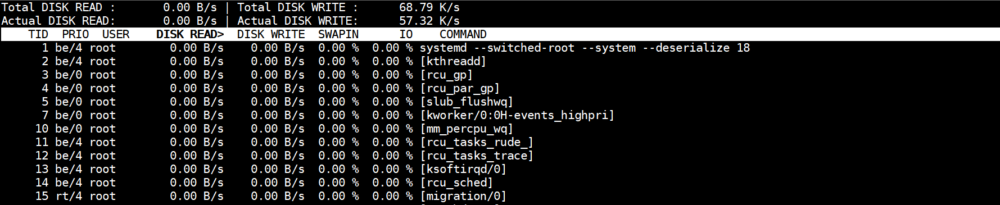

# iotop

## 1.作用

1. 用来监视磁盘 I/O 使用状况的工具
2. **iotop 命令** 是一个用来监视磁盘 I/O 使用状况的 top 类工具。iotop 具有与 top 相似的 UI，其中包括 PID、用户、I/O、进程等相关信息。
3. Linux 下的 IO 统计工具如 iostat，nmon 等大多数是只能统计到 per 设备的读写情况，如果你想知道每个进程是如何使用 IO 的就比较麻烦，使用 iotop 命令可以很方便的查看。
4. iotop 使用 Python 语言编写而成，要求 Python2.5（及以上版本）和 Linux kernel2.6.20（及以上版本）。iotop 提供有源代码及 rpm 包，可从其官方主页下载。

## 2.语法

~~~shell
iotop（选项）
~~~

### 2.1.选项

~~~shell
-o：只显示有io操作的进程
-b：批量显示，无交互，主要用作记录到文件。
-n NUM：显示NUM次，主要用于非交互式模式。
-d SEC：间隔SEC秒显示一次。
-p PID：监控的进程pid。
-u USER：监控的进程用户。
~~~

### 2.2.iotop 常用快捷键

1. 左右箭头：改变排序方式，默认是按 IO 排序。
2. r：改变排序顺序。
3. o：只显示有 IO 输出的进程。
4. p：进程/线程的显示方式的切换。
5. a：显示累积使用量。
6. q：退出。

## 3.实例

~~~shell
root@A-YYYPT-K45-M01 /root # iotop
~~~

### 3.1.参数解释

1. **Total DISK READ**: 总体磁盘读取速率，这里是 `0.00 B/s`，表示没有磁盘读操作。
2. **Total DISK WRITE**: 总体磁盘写入速率，这里是 `54.14 K/s`，表示所有进程的磁盘写操作总速率为 54.14 KB/s。
3. **Actual DISK READ**: 实际磁盘读取速率，这里是 `0.00 B/s`，表示当前没有磁盘读操作。
4. **Actual DISK WRITE**: 实际磁盘写入速率，这里是 `54.14 K/s`，表示所有进程的磁盘写操作总速率为 54.14 KB/s。实际磁盘写入速率与总体磁盘写入速率一致，说明当前没有延迟或缓存效应影响。
5. **TID**: 线程 ID。
6. **PRIO**: 优先级。
7. **USER**: 进程所属用户。
8. **DISK READ**: 该进程的磁盘读取速率。
9. **DISK WRITE**: 该进程的磁盘写入速率。
10. **SWAPIN**: 进程的交换空间使用情况，通常显示该进程从交换空间读取数据的速率。
11. **IO**: 进程的 I/O 操作总速率。
12. **COMMAND**: 进程的命令名称。

### 3.2.生产关注

1. **磁盘读写速率**:
   - **Total DISK READ** 和 **Actual DISK READ** 为 `0.00 B/s`，表明没有磁盘读取操作。
   - **Total DISK WRITE** 和 **Actual DISK WRITE** 为 `54.14 K/s`，这是一个相对较低的写入速率。一般来说，这个值是否正常取决于你的系统和应用程序的工作负载。
2. **无读操作**:
   - 如果系统需要频繁读取数据，而 `Total DISK READ` 始终为 `0.00 B/s`，可能需要检查应用程序是否正常运行或是否有配置错误。
3. **写操作速率**:
   - 54.14 KB/s 的写入速率是否正常取决于应用场景。如果你的应用程序在进行大量数据处理，这个写入速率可能显得较低。相反，如果你的应用程序有较少的磁盘写入需求，那么这个速率是正常的。

### 3.3.常见的异常情况

1. **磁盘写入高峰**:
   - 如果你发现 `Total DISK WRITE` 持续较高（比如超过 100 MB/s），可能需要调查哪些进程在进行大量写入，是否存在不正常的写操作。
2. **磁盘读写不匹配**:
   - 如果磁盘读写速率异常不匹配，比如读速率高但写速率低，或者读速率低但写速率高，可能表示应用程序或系统的 I/O 操作有问题。
3. **高 I/O 等待时间**:
   - 高 I/O 等待时间（%iowait）通常表示磁盘 I/O 性能瓶颈，可能需要检查磁盘性能或优化应用程序的 I/O 操作。

