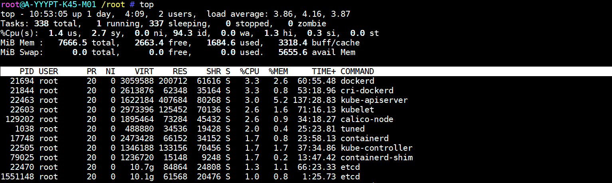

# top

## 1.作用

1. 显示或管理执行中的程序
2. **top 命令** 可以实时动态地查看系统的整体运行情况，是一个综合了多方信息监测系统性能和运行信息的实用工具。通过 top 命令所提供的互动式界面，用热键可以管理。

## 2.语法

~~~shell
top (选项)
~~~

### 2.1.选项

~~~shell
-b：以批处理模式操作；
-c：显示完整的治命令；
-d：屏幕刷新间隔时间；
-I：忽略失效过程；
-s：保密模式；
-S：累积模式；
-i<时间>：设置间隔时间；
-u<用户名>：指定用户名；
-p<进程号>：指定进程；
-n<次数>：循环显示的次数
~~~

### 2.2.top 交互命令

top 命令执行过程中可以使用的一些交互命令。这些命令都是单字母的，如果在命令行中使用了-s 选项， 其中一些命令可能会被屏蔽。

~~~shell
h：显示帮助画面，给出一些简短的命令总结说明；
k：终止一个进程；
i：忽略闲置和僵死进程，这是一个开关式命令；
q：退出程序；
r：重新安排一个进程的优先级别；
S：切换到累计模式；
s：改变两次刷新之间的延迟时间（单位为s），如果有小数，就换算成ms。输入0值则系统将不断刷新，默认值是5s；
f或者F：从当前显示中添加或者删除项目；
o或者O：改变显示项目的顺序；
l：切换显示平均负载和启动时间信息；
m：切换显示内存信息；
t：切换显示进程和CPU状态信息；
c：切换显示命令名称和完整命令行；
M：根据驻留内存大小进行排序；
P：根据CPU使用百分比大小进行排序；
T：根据时间/累计时间进行排序；
w：将当前设置写入~/.toprc文件中。
~~~

## 3.实例

~~~shell
root@A-YYYPT-K45-M01 /root # top
~~~

### 3.1.参数介绍

#### 3.1.1.系统总览

~~~shell
top - 10:52:35 up 1 day,  4:08,  2 users,  load average: 3.97, 4.22, 3.89
~~~

1. **时间**: 当前时间为 10:52:35。
2. **系统运行时间**: 系统已运行 1 天 4 小时 8 分钟。
3. **用户数**: 当前有 2 个用户登录。
4. **负载平均值**: 最近 1 分钟、5 分钟和 15 分钟的系统负载分别为 3.97、4.22 和 3.89。
   - 负载平均值表示在指定时间内，系统上等待 CPU 资源的进程数量的平均值。一般来说，这个值与 CPU 核心数进行比较。例如，如果系统有 4 个 CPU 核心，负载平均值接近 4 就是比较正常的。如果负载平均值远高于核心数，系统可能会过载。

#### 3.1.2.任务状态

~~~shell
Tasks: 337 total,   1 running, 336 sleeping,   0 stopped,   0 zombie
~~~

1. **总任务数**: 337 个进程。
2. **运行中**: 1 个进程正在运行。
3. **休眠中**: 336 个进程在休眠中。
4. **已停止**: 0 个进程。
5. **僵尸进程**: 0 个进程（僵尸进程是已经完成但其父进程尚未回收的进程）。

#### 3.1.3.CPU 使用情况

~~~shell
%Cpu(s):  1.4 us,  1.7 sy,  0.0 ni, 95.8 id,  0.0 wa,  0.7 hi,  0.5 si,  0.0 st
~~~

1. **%us**: 用户空间进程的 CPU 使用率 (1.4%)。
2. **%sy**: 内核空间进程的 CPU 使用率 (1.7%)。
3. **%ni**: 用户空间进程的 CPU 使用率（以 nice 优先级运行） (0.0%)。
4. **%id**: CPU 空闲时间 (95.8%)。
5. **%wa**: 等待 I/O 操作的 CPU 时间 (0.0%)。
6. **%hi**: 硬中断处理的 CPU 时间 (0.7%)。
7. **%si**: 软件中断处理的 CPU 时间 (0.5%)。
8. **%st**: 虚拟化环境中被抢占的 CPU 时间 (0.0%)。

>**CPU 使用情况分析**:
>
>- **%id** 95.8% 表示 CPU 大部分时间处于空闲状态，说明系统负载较低。
>- **%wa** 0.0% 表示系统几乎没有等待 I/O 操作的时间，说明磁盘 I/O 性能良好。

#### 3.1.4.内存使用情况

~~~shell
MiB Mem :   7666.5 total,   2663.9 free,   1684.3 used,   3318.2 buff/cache
MiB Swap:      0.0 total,      0.0 free,      0.0 used.   5655.9 avail Mem
~~~

1. **总内存**: 7666.5 MiB
2. **空闲内存**: 2663.9 MiB
3. **已用内存**: 1684.3 MiB
4. **缓存/缓冲内存**: 3318.2 MiB（用于文件系统缓存）
5. **总交换空间**: 0.0 MiB（未配置交换空间）
6. **已用交换空间**: 0.0 MiB
7. **可用内存**: 5655.9 MiB（可用来分配给新的进程）

>**内存使用情况分析**:
>
>- **空闲内存**: 2663.9 MiB 表示当前有足够的空闲内存。
>- **缓存/缓冲内存**: 3318.2 MiB 表示大量内存被用于缓存，这通常是正常的，因为操作系统会利用空闲内存来缓存文件数据以提高性能。
>- **无交换空间**: 系统没有配置交换空间，这通常对性能有利，但如果内存不足时会导致系统无法处理额外的内存需求。

#### 3.1.5.进程信息

~~~shell
PID USER      PR  NI    VIRT    RES    SHR S  %CPU  %MEM     TIME+ COMMAND
~~~

1. **PID**: 进程 ID。
2. **USER**: 进程的所有者。
3. **PR**: 进程优先级。
4. **NI**: 进程的 nice 值（优先级调整）。
5. **VIRT**: 进程使用的虚拟内存总量。
6. **RES**: 进程实际使用的物理内存。
7. **SHR**: 进程共享的内存。
8. **S**: 进程状态（例如，`S` 表示睡眠状态）。
9. **%CPU**: 进程的 CPU 使用率。
10. **%MEM**: 进程的内存使用率。
11. **TIME+**: 进程的累计 CPU 时间。
12. **COMMAND**: 进程运行的命令。

>异常情况分析:
>
>1. **负载平均值过高**:
>   - 负载平均值为 3.97、4.22、3.89。这接近或略高于你系统的 CPU 核心数（如果有 4 个核心），这种负载通常是可以接受的，但如果负载持续偏高且 CPU 使用率也高，可能需要进一步调查。
>2. **内存使用**:
>   - 虽然 `buff/cache` 的使用量较高，但系统还有足够的可用内存（5655.9 MiB）。这通常没有问题，但如果可用内存持续减少或系统开始使用交换空间，就需要关注。
>3. **CPU 使用率**:
>   - CPU 使用率非常低（1.4% 用户空间 + 1.7% 内核空间），这表明系统负载很轻，性能良好。

​	