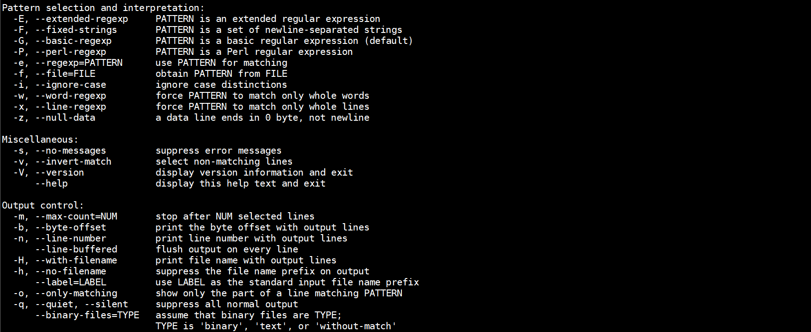

# grep

## 1.概念

> grep 是 Linux/Unix 系统中的一个命令行工具，用于从文件中搜索文本或字符串。grep 代表全局正则表达式打印。当我们使用指定字符串运行 grep 命令时，如果匹配，则它将显示包含该字符串的所在行，而不修改现有文件的内容。

## 2.语法

~~~shell
grep  <Options> <Search String>  <File-Name>
~~~

## 3.案例

- `-E`：使用扩展正则表达式，支持更多的正则语法。

~~~shell
grep -E "^(foo|bar)$" file.txt  # 查找完全是"foo"或"bar"的行。
grep -E "[0-9]{3}" file.txt      # 查找包含至少三个连续数字的行。
~~~

- `-F`:  将模式视为固定字符串，而非正则表达式。

~~~shell
grep -F "fixed_string" file.txt  # 查找包含"fixed_string"的行。
grep -F "hello\nworld" file.txt   # 查找包含多行固定字符串的行。
~~~

- `-P`:  使用Perl兼容正则表达式，支持更复杂的模式。

~~~shell
grep -P "^\d" file.txt             # 查找以数字开头的行。
grep -P "(.)\1" file.txt           # 查找包含重复字符的行。
~~~

- `-e`:  使用指定的模式进行匹配，可以使用多个模式。

~~~shell
grep -e "error" -e "warning" file.txt  # 查找包含"error"或"warning"的行。
grep -e "foo" file.txt                   # 查找包含"foo"的行。
~~~

- `-f`:  从文件中读取匹配模式。

~~~shell
grep -f patterns.txt file.txt  # 从patterns.txt文件中读取模式并在file.txt中查找。
grep -f patterns1.txt -f patterns2.txt file.txt  # 使用多个模式文件进行查找。
~~~

- `-i`:  忽略大小写进行匹配。

~~~shell
grep -i "hello" file.txt       # 查找包含"hello"、"Hello"、"HELLO"等的行。
grep -i "warning" file.txt      # 查找包含"warning"或"WARNING"等的行。
~~~

- `-w`:  强制模式只匹配整个单词。

~~~shell
grep -w "word" file.txt         # 只查找完整单词"word"的行。
grep -w "test" file.txt          # 查找仅包含"test"的行，避免部分匹配。
~~~

- `-x`:  强制模式匹配整行。

~~~shell
grep -x "exact line" file.txt   # 查找完全是"exact line"的行。
grep -x "test" file.txt          # 查找只包含"test"的行。
~~~

- `-q`:  在查找时抑制所有正常输出，只返回退出状态。适用于仅需要检查模式是否存在的场景。如果找到匹配，退出状态为0；如果未找到，退出状态为1；如果发生错误，退出状态为2。

~~~shell
grep -q "search_string" file.txt
if [ $? -eq 0 ]; then
    echo "Found!"
else
    echo "Not found."
fi
~~~

- `-r`:  递归地搜索指定目录中的所有文件及子目录。适用于需要在整个目录树中查找特定模式的

~~~shell
grep -r "search_string" /path/to/directory
~~~

- `-o`:  只显示匹配模式的部分，而不是整行。适用于提取特定模式的场景。输出结果仅包含与模式匹配的内容，适合提取信息

~~~shell
grep -o "[a-zA-Z0-9._%+-]+@[a-zA-Z0-9.-]+\.[a-zA-Z]{2,6}" file.txt
~~~

- `-v`:  取反匹配，选择不匹配模式的行。

~~~shell
grep -v "test" file.txt       # 显示不包含"test"的行。
grep -v -e "error" -e "warn" file.txt  # 显示不包含"error"或"warn"的行。
~~~

- `-B`:  显示匹配行前的NUM行。

~~~shell
grep -B 2 "search_string" file.txt  # 显示匹配行及其前2行。
~~~

- `-A`:  显示匹配行后的NUM行。

~~~shell
grep -A 2 "search_string" file.txt  # 显示匹配行及其后2行。
~~~

- `-C`:  显示匹配行前后的NUM行。

~~~shell
grep -C 3 "search_string" file.txt  # 显示匹配行及其前后3行。
~~~

## 4.正则表达式

> 扩展正则表达式提供了更多的功能，允许使用更复杂的模式匹配。

| 正则符号 | 描述                                   |
| -------- | -------------------------------------- |
| ^        | 匹配行首                               |
| $        | 匹配行尾                               |
| [ ]      | 集合，匹配集合中的任意单个字符         |
| [^ ]     | 对集合取反                             |
| .        | 匹配任意单个字符                       |
| *        | 匹配前一个字符任意次。（不能单独使用） |
| \{n,m\\} | 匹配前一个字符n到m次                   |
| \{n,\\}  | 匹配前一个字符n次                      |
| {n\\}    | 匹配前一个字符n次及以上                |
| \\(\\)   | 保留                                   |
| +        | 最少匹配一次                           |
| ?        | 最多匹配一次                           |
| {n,m}    | 匹配n到m次                             |
| ()       | 组合为整体，保留                       |
| \|       | 或者                                   |
| \b       | 单词边界                               |

### 4.1.案例

~~~shell
grep ^root    file.txt        #找以root开头的行
grep bash$    file.txt        #找以bash结尾的行
grep ^$       file.txt        #找空行
grep -v ^$    file.txt        #显示除了空行的内容
grep "[root]" file.txt        #找r、o、t任意一个字符
grep "[rot]"  file.txt        #效果同上
grep "[^rot]" file.txt        #显示r或o或t以外的内容
grep "[0-9]"  file.txt        #找所有数字
grep "[^0-9]" file.txt        #显示数字以外内容
grep "[a-z]" file.txt         #找所有小写字母
grep "[A-Z]" file.txt         #找所有大写字母
grep "[a-Z]" file.txt         #找所有字母
grep "[^0-9a-Z]" file.txt     #找所有符号
grep "."    file.txt          #找任意单个字符，文档中每个字符都可以理解为任意字符
grep "r..t" file.txt          #找rt之间有2个任意字符的行
grep "r.t" file.txt           #找rt之间有1个任意字符的行，没有匹配内容，就无输出
grep "*" file.txt             #错误用法，*号是匹配前一个字符任意次，不能单独使用
grep "ro*t" file.txt          #找rt，中间的o有没有都行，有几次都行
grep ".*" file.txt            #找任意，包括空行 .与*的组合在正则中相当于通配符的效果
grep "ro\{1,2\}t" file.txt    #找rt，中间的o可以有1~2个
grep "ro\{2,6\}t" file.txt    #找rt，中间的o可以有2~6个
grep "ro\{1,\}t" file.txt     #找rt，中间的o可以有1个以及1个以上
grep "ro\{3\}t" file.txt      #找rt，中间的o必须只有有3个
egrep "ro{1,}t" file.txt      #找o出现1次以及1次以上
egrep "roo{0,1}t" file.txt    #找第二个o出现0~1次
egrep "(0:){2}" file.txt      #找连续的2个0:  小括号的作用是将字符组合为一个整体
egrep "root|bin" file.txt     #找有root或者bin的行
egrep  "the\b" abc.txt        #在abc.txt文件中找the，右边不允许出现数字、字母、下划线
egrep  "\bthe\b" abc.txt      #两边都不允许出现数字、字母、下划线
egrep  "\<the\>" abc.txt      #效果同上

可以加-E选项并且去掉所有\，改成扩展正则的用法，比如：
grep "ro\{1,\}t" file.txt可以改成 grep -E "ro{1,}t" file.txt 或者 egrep "ro{1,}t" file.txt   
~~~

