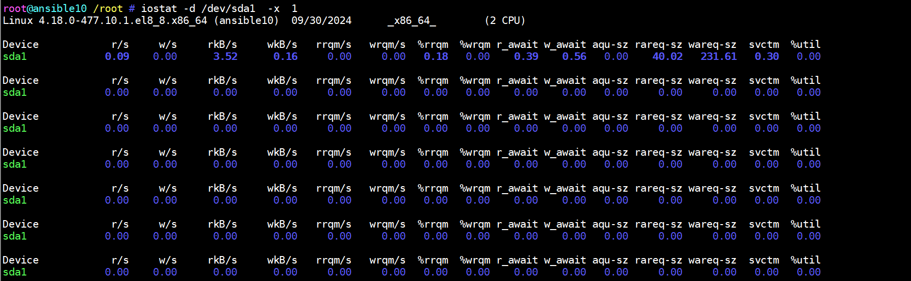

# iostat

## 1.作用

1. 监视系统输入输出设备和 CPU 的使用情况
2. **iostat 命令** 被用于监视系统输入输出设备和 CPU 的使用情况。它的特点是汇报磁盘活动统计情况，同时也会汇报出 CPU 使用情况。同 vmstat 一样，iostat 也有一个弱点，就是它不能对某个进程进行深入分析，仅对系统的整体情况进行分析。

## 2.语法

~~~shell
iostat (选项) (参数)
~~~

### 2.1.选项

~~~shell
-c：仅显示CPU使用情况；
-d：仅显示设备利用率；
-k：显示状态以千字节每秒为单位，而不使用块每秒；
-m：显示状态以兆字节每秒为单位；
-p：仅显示块设备和所有被使用的其他分区的状态；
-t：显示每个报告产生时的时间；
-V：显示版号并退出；
-x：显示扩展状态。
~~~

### 2.2.参数

~~~shell
间隔时间：每次报告的间隔时间（秒）；
次数：显示报告的次数。
~~~

## 3.实例

1. 用    iostat -x /dev/sda1  -x  1    来观看磁盘 I/O 的详细情况：

1. 详细说明：第二行是系统信息和监测时间，第三行和第四行显示 CPU 使用情况（具体内容和 mpstat 命令相同）。这里主要关注后面 I/O 输出的信息，如下所示：

| 标示     | 说明                                |
| -------- | ----------------------------------- |
| Device   | 监测设备名称                        |
| rrqm/s   | 每秒需要读取需求的数量              |
| wrqm/s   | 每秒需要写入需求的数量              |
| r/s      | 每秒实际读取需求的数量              |
| w/s      | 每秒实际写入需求的数量              |
| rsec/s   | 每秒读取区段的数量                  |
| wsec/s   | 每秒写入区段的数量                  |
| rkB/s    | 每秒实际读取的大小，单位为 KB       |
| wkB/s    | 每秒实际写入的大小，单位为 KB       |
| avgrq-sz | 需求的平均大小区段                  |
| avgqu-sz | 需求的平均队列长度                  |
| await    | 等待 I/O 平均的时间（milliseconds） |
| svctm    | I/O 需求完成的平均时间              |
| %util    | 被 I/O 需求消耗的 CPU 百分比        |

## 4.生产关注

### 4.1.CPU 使用情况

1. **%user**：用户空间的 CPU 时间。
   - **异常**：如果超过 80% 时，可能表明 CPU 负载过高，应用程序可能需要优化。
2. **%system**：内核空间的 CPU 时间。
   - **异常**：如果持续超过 20% 可能表明系统调用或内核活动过多。
3. **%iowait**：CPU 等待 I/O 操作的时间。
   - **异常**：如果持续超过 20%，说明 I/O 性能可能是瓶颈，需要优化存储性能或检查 I/O 操作。
4. **%idle**：CPU 空闲时间。
   - **异常**：如果低于 20%，表明 CPU 负载很高，可能需要扩展资源或优化应用程序。

### 4.2.磁盘 I/O

1. **%util**：磁盘利用率。
   - **异常**：如果持续超过 80%，可能说明磁盘 I/O 瓶颈，需要考虑优化存储性能或扩展存储资源。
2. **r/s 和 w/s**：读写操作每秒。
   - **异常**：如果读写操作很高，并且对应的 I/O 等待时间也很高，可能需要优化磁盘性能或检查应用程序的磁盘访问模式。
3. **r_await 和 w_await**：读写操作的平均等待时间。
   - **异常**：如果读写等待时间持续超过 10 毫秒，可能需要检查磁盘性能或负载。
4. **aqu-sz**：平均队列长度。
   - **异常**：如果持续超过 2，说明磁盘 I/O 请求在队列中堆积，可能需要优化磁盘 I/O 性能。