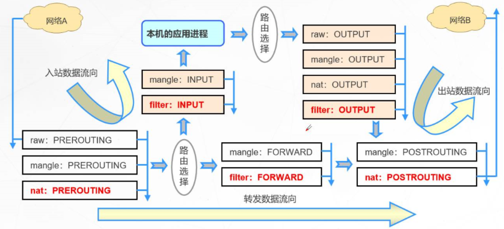

# iptables

## 1.简介

1.  netfilter/iptables（简称为iptables）组成Linux平台下的包过滤防火墙，是Linux内核中用于配置和管理网络流量的工具。它主要用于包过滤、网络地址转换（NAT）和包重定向等功能。
2. iptables通过设置规则链来决定如何处理传入和传出的数据包，这些规则基于源地址、目的地址、协议类型等条件。iptables支持多种操作，如接受、拒绝或丢弃数据包，广泛应用于防火墙和流量控制。

## 2.iptables基础

1. 规则（rules）其实就是网络管理员预定义的条件，规则一般的定义为“如果数据包头符合这样的条件，就这样处理这个数据包”。
2. 规则存储在内核空间的信息 包过滤表中，这些规则分别指定了源地址、目的地址、传输协议（如TCP、UDP、ICMP）和服务类型（如HTTP、FTP和SMTP）等。
3. 当数据包与规 则匹配时，iptables就根据规则所定义的方法来处理这些数据包，如放行（accept）、拒绝（reject）和丢弃（drop）等。
4. 配置防火墙的 主要工作就是添加、修改和删除这些规则。

## 3.iptables和netfilter关系

1. Linux防火墙是由Netfilter组件提供的，Netfilter工作在内核空间，集成在linux内核中Netfilter 是Linux 2.4.x之后新一代的Linux防火墙机制，是linux内核的一个子系统。Netfilter采用模块化设计，具有良好的可扩充性，提供扩展各种网络服务的结构化底层框架。
2. iptables是一个用户空间工具，用于配置Linux内核中的Netfilter框架。Netfilter提供了一个强大的机制，用于处理、地址转换和过滤网络流量等操作，而iptables则是与之交互的接口，允许用户设置规则和链。
3. 简单来说，Netfilter是底层的处理框架，iptables是其上层的管理工具。两者结合，使得Linux系统能够灵活地管理网络流量和安全性。

>Netfilter官网文档：https://netfilter.org/documentation/

~~~shell
## Linux内核中Netfilter相关功能的启用或禁用标志

root@ansible10 ~ #  grep -m 10 NETFILTER /boot/config-4.18.0-477.10.1.el8_8.x86_64 
CONFIG_NETFILTER=y
CONFIG_NETFILTER_ADVANCED=y
CONFIG_BRIDGE_NETFILTER=m
CONFIG_NETFILTER_INGRESS=y
CONFIG_NETFILTER_NETLINK=m
CONFIG_NETFILTER_FAMILY_BRIDGE=y
CONFIG_NETFILTER_FAMILY_ARP=y
# CONFIG_NETFILTER_NETLINK_ACCT is not set
CONFIG_NETFILTER_NETLINK_QUEUE=m
CONFIG_NETFILTER_NETLINK_LOG=m
~~~

## 4.iptables组成

1. **表（Tables）**：
   - **filter**：默认表，用于包过滤。主要包含 INPUT、OUTPUT 和 FORWARD 链。
   - **nat**：用于网络地址转换，主要处理出站和入站的流量重写。包含 PREROUTING、POSTROUTING 和 OUTPUT 链。
   - **mangle**：用于修改数据包的某些字段，比如QoS标记。包含 INPUT、OUTPUT、FORWARD、PREROUTING 和 POSTROUTING 链。
   - **raw**：用于处理特定数据包，主要用于配置跳过连接跟踪的规则。
2. **链（Chains）**：每个表由若干链组成。链是规则的集合
   - **INPUT**：处理进入本机的数据包。
   - **OUTPUT**：处理由本机发出的数据包。
   - **FORWARD**：处理转发的数据包（即不直接进入或离开本机）。
   - **PREROUTING**：在路由决策之前处理入站数据包。
   - **POSTROUTING**：在路由决策之后处理出站数据包。
3. **规则（Rules）**：
   - 每个链由多个规则组成，规则定义了如何处理匹配的数据包。规则通常包含条件（如源地址、目的地址、协议类型等）和动作（如 ACCEPT、DROP、REJECT、SNAT、DNAT 等）。
4. **目标（Targets）**：规则的处理动作。常见的目标包括
   - **ACCEPT**：允许数据包通过。
   - **DROP**：丢弃数据包，不发送任何响应。
   - **REJECT**：丢弃数据包，并发送拒绝响应。
   - **LOG**：记录匹配的数据包信息。
   - **RETURN**：返回到前一个链继续处理。

- 表和链对应关系

- 数据包过滤匹配流程

>内核中数据包的传输过程
>
>- 当一个数据包进入网卡时，数据包首先进入PREROUTING链，内核根据数据包目的IP判断是否需要转送出去
>- 如果数据包是进入本机的，数据包就会沿着图向下移动，到达INPUT链。数据包到达INPUT链后，任何进程都会收到它。本机上运行的程序可以发送数据包，这些数据包经过OUTPUT链，然后到达POSTROUTING链输出
>- 如果数据包是要转发出去的，且内核允许转发，数据包就会向右移动，经过FORWARD链，然后到达POSTROUTING链输出

## 5.安装iptables

>:bell:CentOS 7 上默认安装了 firewalld 作为防火墙，使用 iptables 建议关闭并禁用 firewalld。

~~~shell
root@ansible10  systemctl disable firewalld --now
root@ansible10  yum -y install iptables-services
root@ansible10  rpm -qi iptables         
Name        : iptables
Version     : 1.8.4
Release     : 24.el8
Architecture: x86_64
Install Date: Thu 20 Jun 2024 08:26:07 PM CST
Group       : Unspecified
Size        : 1961577
License     : GPLv2 and Artistic 2.0 and ISC
Signature   : RSA/SHA256, Thu 24 Nov 2022 01:05:37 AM CST, Key ID 199e2f91fd431d51
Source RPM  : iptables-1.8.4-24.el8.src.rpm
Build Date  : Wed 23 Nov 2022 10:35:48 AM CST
Build Host  : x86-038.build.eng.bos.redhat.com
Relocations : (not relocatable)
Packager    : Red Hat, Inc. <http://bugzilla.redhat.com/bugzilla>
Vendor      : Red Hat, Inc.
URL         : http://www.netfilter.org/projects/iptables
Summary     : Tools for managing Linux kernel packet filtering capabilities
----------------------------------------------------------------------------------
root@ansible10  systemctl enable --now firewalld.service           
root@ansible10  systemctl status firewalld.service
~~~

### 5.1.服务管理

1. 查看状态：`systemctl status  iptables`
2. 启用服务：`systemctl enable  iptables`
3. 禁用服务：`systemctl disable iptables`
4. 启动服务：`systemctl start   iptables`
5. 重启服务：`systemctl restart iptables`
6. 关闭服务: `systemctl  stop    iptables`

## 6.iptables用法说明

- 帮助

~~~shell
root@ansible10  man 8 iptables
~~~

~~~shell
iptables [-t table] {-A|-C|-D} chain rule-specification
iptables [-t table] -I chain [rulenum] rule-specification
iptables [-t table] -R chain rulenum rule-specification
iptables [-t table] -D chain rulenum
iptables [-t table] -S [chain [rulenum]]
iptables [-t table] {-F|-L|-Z} [chain [rulenum]] [options...]
iptables [-t table] -N chain
iptables [-t table] -X [chain]
iptables [-t table] -P chain target
iptables [-t table] -E old-chain-name new-chain-name
~~~

### 6.1.iptables规则添加时考量点

1. 要实现哪种功能：判断添加在哪张表上
2. 报文流经的路径：判断添加在哪个链上
3. 报文的流向：判断源和目的
4. 匹配规则：业务需要

### 6.2.iptables命令格式详解

~~~shell
iptables [-t table] SUBCOMMAND chain [-m matchname [per-match-options]] -j targetname [per-target-options]
~~~

1. **-t table**：指定表
   - raw, mangle, nat, [filter]默认
2. **SUBCOMMAND**：子命令
   - 链管理类
     - -N：new, 自定义一条新的规则链
     - -E：重命名自定义链；引用计数不为0的自定义链不能够被重命名，也不能被删除
     - -X：delete，删除自定义的空的规则链
     - -P：Policy，设置默认策略；对filter表中的链而言，其默认策略有：ACCEPT：接受, DROP：丢弃
   - 查看类
     - -L：list, 列出指定鏈上的所有规则，本选项须置后
     - -n：numberic，以数字格式显示地址和端口号
     - -v：verbose，详细信息
     - -vv 更详细
     - -x：exactly，显示计数器结果的精确值,而非单位转换后的易读值
     - --line-numbers：显示规则的序号
     - -S selected,以iptables-save 命令格式显示链上规则
   - 常用组合
     - -vnL 
     - -vvnxL --line-numbers
   - 规则管理类
     - -A：append，追加
     - -I：insert, 插入，要指明插入至的规则编号，默认为第一条
     - -D：delete，删除
       - (1) 指明规则序号
       - (2) 指明规则本身
     - -R：replace，替换指定链上的指定规则编号
     - -F：flush，清空指定的规则链
     - -Z：zero，置零
       - iptables的每条规则都有两个计数器
       - (1) 匹配到的报文的个数
       - (2) 匹配到的所有报文的大小之和
3. **chain**：PREROUTING，INPUT，FORWARD，OUTPUT，POSTROUTING
4. **匹配条件**：
   - 基本：通用的，PARAMETERS
   - 扩展：需加载模块，MATCH EXTENTIONS
5. **处理动作：**
   - -j targetname [per-target-options]
   - 扩展动作
     - REJECT：--reject-with:icmp-port-unreachable默认
     - RETURN：返回调用链
     - REDIRECT：端口重定向
     - DNAT：目标地址转换
     - SNAT：源地址转换

### 6.3.iptables基本匹配条件

1. 基本匹配条件：无需加载模块，由iptables/netfilter自行提供

~~~shell
-s, --source address[/mask][,...]：源IP地址或者不连续的IP地址
-d, --destination address[/mask][,...]：目标IP地址或者不连续的IP地址
-p, --protocol protocol：指定协议，可使用数字如0（all）protocol: tcp, udp, icmp, icmpv6, udplite,esp, ah, sctp, mh or“all“参看：/etc/protocols
-i, --in-interface name：报文流入的接口；只能应用于数据报文流入环节，只应用于INPUT、FORWARD、PREROUTING链
-o, --out-interface name：报文流出的接口；只能应用于数据报文流出的环节，只应用于FORWARD、OUTPUT、POSTROUTING链
~~~

>:bell:案例

~~~shell
## 拒绝来自 192.168.1.112 和 192.168.1.113 的所有入站连接请求，同时会向这些IP地址发送拒绝信息。这可以用于阻止特定IP的流量访问本机。
root@ansible10 /root # iptables -A INPUT -s 192.168.1.112,192.168.1.113 -j REJECT
~~~

~~~shell
## 允许来自IP地址 10.0.0.6 的所有非ICMP流量通过INPUT链，而ICMP流量（如ping请求）将不会被允许。这可以用于控制流量类型的访问，允许特定IP的其他流量同时拒绝其ICMP流量。
root@ansible10 /root # iptables -I INPUT 2 -s 192.168.1.112 ! -p icmp -j ACCEPT
root@ansible10 /root # iptables -I INPUT 1 -s 192.168.1.112 -p icmp -j REJECT
~~~

### 6.4.iptables扩展匹配条件

1. 扩展匹配条件：需要加载扩展模块（/usr/lib64/xtables/*.so），方可生效
2. 扩展模块的查看帮助 ：man iptables-extensions
3. 扩展匹配条件：
   - 隐式扩展
   - 显式扩展

#### 6.4.1.隐式扩展

1. iptables 在使用-p选项指明了特定的协议时，无需再用-m选项指明扩展模块的扩展机制，不需要手动加载扩展模块

>:bell:tcp协议的扩展选项

~~~shell
--source-port,      --sport port[:port]：匹配报文源端口,可为端口连续范围
--destination-port, --dport port[:port]：匹配报文目标端口,可为连续范围
--tcp-flags mask comp
	mask 需检查的标志位列表，用,分隔 , 例如 SYN,ACK,FIN,RST
	--tcp-flags SYN,ACK,FIN,RST SYN 表示要检查的标志位为SYN,ACK,FIN,RST四个，其中SYN必须为1，余下的必须为0，第一次握手
	--syn：用于匹配第一次握手, 相当于：--tcp-flags SYN,ACK,FIN,RST SYN
	--tcp-flags SYN,ACK,FIN,RST SYN,ACK 第二次握手
	
	comp 在mask列表中必须为1的标志位列表，无指定则必须为0，用,分隔tcp协议的扩展选项
	--tcp-flags ALL ALL  
	--tcp_flags ALL NONE
~~~

>:bell:udp协议的扩展选项

~~~shell
--source-port, --sport port[:port]：匹配报文的源端口或端口范围
--destination-port,--dport port[:port]：匹配报文的目标端口或端口范围
~~~

>:bell:icmp协议的扩展选项

~~~shll
--icmp-type {type[/code]|typename}
	type/code
		 0/0   echo-reply icmp应答
		 8/0   echo-request icmp请求
~~~

>:bell:案例

~~~shell
## 1.拒绝来自 10.0.0.6 的所有TCP流量，尤其是目标端口在21到23之间的连接请求。这样可以有效地阻止该IP对FTP和Telnet服务的访问。
root@ansible10 /root # iptables -A INPUT -s 10.0.0.6 -p tcp --dport 21:23 -j REJECT

## 2.绝所有进入的TCP连接请求（SYN包）。这样会阻止任何尝试与本机建立TCP连接的请求，这通常用于防止未经授权的访问。
root@ansible10 /root # iptables -A INPUT -p tcp --syn -j REJECT

## 3.拒绝来自 10.0.0.6 的所有ping请求（即ICMP回显请求）。这将阻止该IP对本机的ping测试，确保该IP无法探测到本机的可达性。
root@ansible10 /root # iptables -A INPUT -s 10.0.0.6 -p icmp --icmp-type 8 -j REJECT
~~~

#### 6.4.2.显式扩展及相关模块

1. 显示扩展即必须使用 `-m` 选项指明要调用的扩展模块名称，需要手动加载扩展模块
2.  [-m matchname [per-match-options]]
3. 扩展模块的使用帮助
   - CentOS 7,8: man iptables-extensions 
   - CentOS 6: man iptables

##### 6.4.2.1.multiport扩展

1. 以离散方式定义多端口匹配,最多指定15个端口

~~~shell
--source-ports,--sports port[,port|,port:port]... 指定多个源端口
--destination-ports,--dports port[,port|,port:port]...指定多个目标端口
--ports port[,port|,port:port]... 多个源或目标端
~~~

~~~shell
## 1.允许来自 172.16.0.0/16 网段的所有TCP流量访问 172.16.100.10 的端口20、21、22和80。
root@ansible10 /root # iptables -A INPUT -s 172.16.0.0/16 -d 172.16.100.10 -p tcp -m multiport --dports 20:22,80 -j ACCEPT
~~~

##### 6.4.2.2.iprange扩展

1. 指明连续的（但一般不是整个网络）ip地址范围

~~~shell
--src-range from[-to] 源IP地址范围
--dst-range from[-to] 目标IP地址范围
~~~

~~~shell
## 1.拒绝来自IP地址范围 172.16.1.5 到 172.16.1.10 的TCP流量，特别是访问目标IP 172.16.1.100 的80端口（HTTP服务）。
root@ansible10 /root # iptables -A INPUT -d 172.16.1.100 -p tcp --dport 80 -m iprange --src-range 172.16.1.5-172.16.1.10 -j DROP
~~~

##### 6.4.2.3.connlimit扩展

1. 根据每客户端IP做并发连接数数量匹配，可防止Dos(Denial of Service，拒绝服务)攻击

~~~shell
--connlimit-upto N #连接的数量小于等于N时匹配
--connlimit-above N #连接的数量大于N时匹配
~~~

~~~shell
## 1.限制同时连接到 172.16.100.10 的SSH服务（22端口）的连接数。如果某个源IP的连接数超过2，则拒绝额外的连接请求。
root@ansible10 /root # iptables -A INPUT -d 172.16.100.10 -p tcp --dport 22 -m connlimit --connlimit-above 2 -j REJECT
~~~

##### 6.4.2.4.limit扩展

1. 基于收发报文的速率做匹配 , 令牌桶过滤器

~~~shell
--limit-burst number #前多少个包不限制
--limit #[/second|/minute|/hour|/day]
~~~

~~~shell
## 1.允许对 192.168.1.113 的ping请求（ICMP回显请求），但限制每分钟最多10个请求，并允许最多5个请求的瞬时突发
root@ansible10 /root # iptables -I INPUT -d 192.168.1.113 -p icmp --icmp-type 8 -m limit --limit 10/minute --limit-burst 5 -j ACCEPT
~~~

##### 6.4.2.5.state扩展

1. state 扩展模块，可以根据”连接追踪机制“去检查连接的状态，较耗资源
2. conntrack机制：追踪本机上的请求和响应之间的关系
3. 状态类型
   - NEW：新发出请求；连接追踪信息库中不存在此连接的相关信息条目，因此，将其识别为第一次发出的请求
   - ESTABLISHED：NEW状态之后，连接追踪信息库中为其建立的条目失效之前期间内所进行的通信状态
   - RELATED：新发起的但与已有连接相关联的连接，如：ftp协议中的数据连接与命令连接之间的关系
   - INVALID：无效的连接，如flag标记不正确
   - UNTRACKED：未进行追踪的连接，如：raw表中关闭追踪
4. `/proc/net/nf_conntrack` 文件包含了当前系统上活动的网络连接跟踪信息。它由Netfilter框架生成，用于跟踪和管理网络连接的状态。

~~~shell
--state state

## 1.允许新建的和已建立的连接。
root@ansible10 /root # iptables -A INPUT -d 172.16.1.10 -p tcp -m multiport --dports 22,80 -m state --state NEW,ESTABLISHED -j ACCEPT
~~~

~~~shell
## 1.调整连接追踪功能所能够容纳的最大连接数量
root@ansible10 /root # cat /proc/sys/net/netfilter/nf_conntrack_max
65536
root@ansible10 /root # cat /proc/sys/net/nf_conntrack_max
65536

## 2.查看连接跟踪有多少条目
root@ansible10 /root # cat /proc/sys/net/netfilter/nf_conntrack_count
3

## 3.不同的协议的连接追踪时长
root@ansible10 /root # ll /proc/sys/net/netfilter/
~~~

>:bell:说明：
>
>1. 连接跟踪，需要加载模块： modprobe nf_conntrack_ipv4
>2. 当服务器连接多于最大连接数时dmesg 可以观察到 ：kernel: ip_conntrack: table full, dropping packet错误,并且导致建立TCP连接很慢。
>3. 各种状态的超时后，链接会从表中删除

- 连接过多的解决方法两个：

~~~shell
## 1.加大nf_conntrack_max 值
vim /etc/sysctl.conf
net.nf_conntrack_max = 393216
net.netfilter.nf_conntrack_max = 393216

## 2.降低 nf_conntrack timeout时间
vi /etc/sysctl.conf
net.netfilter.nf_conntrack_tcp_timeout_established = 300
net.netfilter.nf_conntrack_tcp_timeout_time_wait = 120
net.netfilter.nf_conntrack_tcp_timeout_close_wait = 60
net.netfilter.nf_conntrack_tcp_timeout_fin_wait = 120
~~~

## 7.iptables规则保存

1. 使用iptables命令定义的规则，手动删除之前，其生效期限为kernel存活期限

### 7.1.持久保存规则

~~~shell
## 1.CentOS 7,8
root@ansible10 /root # iptables-save > /tmp/iptables01

## 2.CentOS 6，将规则覆盖保存至/etc/sysconfig/iptables文件中
service iptables save
~~~

### 7.2.加载规则

~~~shell
## 1.CentOS 7,8 重新载入预存规则文件中规则：
root@ansible10 /root # iptables-restore < /tmp/iptables01 

## 2.CentOS 6，会自动从/etc/sysconfig/iptables 重新载入规则
service iptables  restart
~~~

### 7.3.开机自动加载规则

1. 用脚本保存各iptables命令；让此脚本开机后自动运行/etc/rc.d/rc.local文件中添加脚本路径 /PATH/TO/SOME_SCRIPT_FILE
2. 用规则文件保存各规则，开机时自动载入此规则文件中的规则在/etc/rc.d/rc.local文件添加。

~~~shell
iptables-restore < /PATH/FROM/IPTABLES_RULES_FILE
~~~

## 8.规则优化最佳实践

1. 安全放行所有入站和出站的状态为ESTABLISHED状态连接,建议放在第一条，效率更高
2. 谨慎放行入站的新请求
3. 有特殊目的限制访问功能，要在放行规则之前加以拒绝
4. 同类规则（访问同一应用，比如：http ），匹配范围小的放在前面，用于特殊处理
5. 不同类的规则（访问不同应用，一个是http，另一个是mysql ），匹配范围大的放在前面，效率更高
6. 应该将那些可由一条规则能够描述的多个规则合并为一条,减少规则数量,提高检查效率
7. 设置默认策略，建议白名单（只放行特定连接）
   - iptables -P，不建议，容易出现“自杀现象”
   - 规则的最后定义规则做为默认策略，推荐使用，放在最后一条

~~~shell
-s 10.0.0.6 -p tcp --dport 3306 -j REJECT
-s 172.16.0.0/16 -p tcp --dport 80 -j REJECT
~~~

